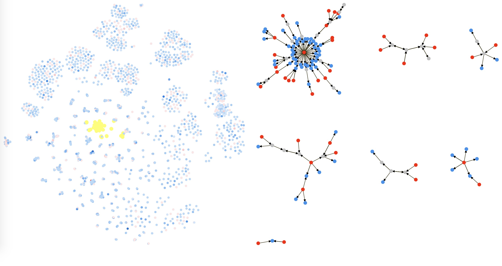

# LongQuan Graph Visualization Project

### Introduction

- LongGraph is a graph visualization project based on the legal case data. each node is a one person, each link is a legal case which are a plaintiff and a defendant. **all legal case is from LongQuan county in Zhijiang Province**, the data are modified due to privately processed.
- In our visulization, the left part is the result of the tsne dimension reduction after the graph embedding(deep walk), and the right part shows the graph layout result of the selected point on left part. You can observe their specific information by clicking on the point or links of the right part. By using graph embedding, the points with similar graph structure are near to each other in space.
- In front end, I use d3 libraryand react framework. In back end, I use tulip graph layout library and scikit-learn and deep walk algorithm(deep walk code isn't provided in this project).




### INSTALL

```bash
# new terminal
cd backend
pip install -r requirements.txt
python router.py


# new terminal
cd frontend
npm install
npm run start

```
then go to [localhost:8080](http://localhost:8080)